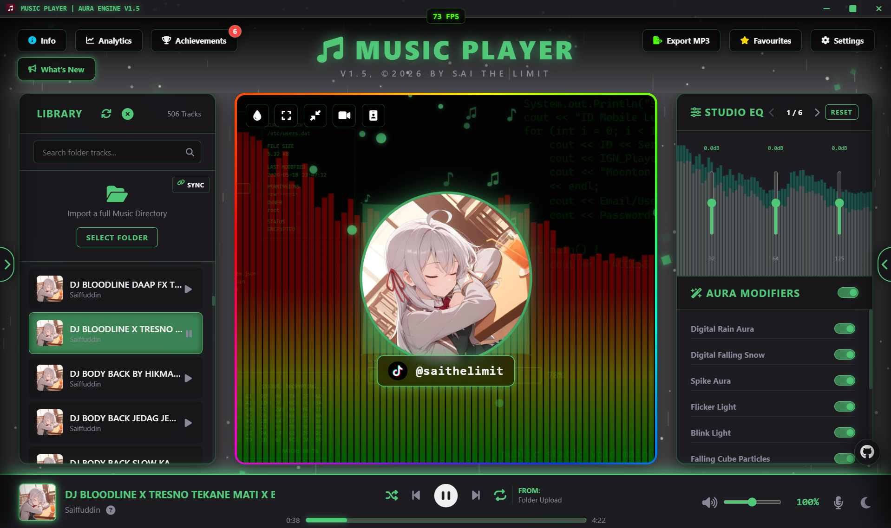

# 🎵 MUSIC PLAYER | AURA ENGINE V1.5

Welcome to **AURA ENGINE**, a premium, client-side glassmorphic music streaming companion. V1.5 is the biggest expansion yet — bringing a standalone desktop app, a gamified Aura Score & rank system, 8D audio panning, full-screen and mini player modes, a native visualizer recorder, and a completely upgraded audio exporter, all running directly inside your browser (or as a native desktop client).



---

## ✨ Advanced Engineering Features

* **Dual-Workspace Library Layer:** Toggle on-the-fly between a persistent local browser library (powered by IndexedDB) and a high-performance **Folder Directory Scanner**, complete with a dedicated Sync button to instantly reload your music directory without manual file re-selection.
* **Aura Library & Playlists:** A dedicated Aura Library panel for streamlined music management, with full custom playlist creation, sorting, and playback integration.
* **Aura Visualizer Matrix:** Dynamic digital rainfall, falling snow, soundwave spiral silhouettes, expanding vector matrices, floating music notes, and rhythmic beat-popping geometry — all syncing in real time with sub-bass frequencies. Includes the new **Aura Flash (Aurora Impact)** effect, with explosive radial blooms and directional silhouette flares that trigger on heavy bass drops.
* **Dual-Channel Stereo Equalizer:** Master 15-band Studio EQ (32Hz–16kHz) across 5 paginated slider tracks, with an interactive mirrored live preview, dedicated Pre-Amp gain, manual acoustic panning, and Sub-Bass focus controls.
* **8D Audio Panning:** Immersive 8D surround sound panning for a dynamic, moving audio experience across your stereo channels.
* **Aura Modifier Rack:** Real-time convolution reverb, playback velocity/pitch scaling, custom crossfade scheduling, and geometric color presets (Ruby, Bronze, Gold, Emerald, Diamond, Sapphire, Amethyst), now with a live canvas preview inside the Modifiers dialog.
* **Floating & Focus Lyrics:** Classic Lyrics Focus Mode plus a new **Floating Action** karaoke mode that spawns animated lyric text floating dynamically around the active cover art.
* **Full Screen & Mini Player:** Cinematic full-screen mode for maximum visualizer immersion, plus a compact floating Mini Player for versatile desktop viewing.
* **Visualizer Recorder:** Capture your live visualizer sessions directly to video, with draggable, customizable social watermark stickers you can place anywhere on the center stage.
* **Custom Stage Backgrounds & Art:** Upload and manage custom stage background covers and track album art, or make the center stage transparent so your background shines through.
* **Aura Score, Ranks & Achievements:** A gamified progression system with dynamic ranks, Aura Score tracking, visually stunning tier-upgrade cards, a full achievements system, and a Bounty Board to track milestones.
* **Aura Analytics Workspace:** Deep library metrics — top genre/artist/album/year, most-played tracks, session and lifetime uptime, live FPS/CPU/GPU/engine load, IndexedDB storage usage, and library diversity stats (favourite ratio, lyrics sync rate, custom backgrounds/art usage).
* **Smart Media Metadata Core:** Automatically parses file metadata and embedded artwork on load using `jsmediatags`.
* **Client-Side Audio Multi-Pass Encoding:** Render and export edited master tracks natively in-browser via `OfflineAudioContext`, now supporting both compressed **MP3** (`lamejs`, 128–320 kbps) and lossless **WAV** export, with editable ID3 tags and direct `.lrc` lyric injection.
* **Desktop Application:** A dedicated Electron-based desktop client with native window support and frameless app layouts, plus exclusive `.mov` 8D audio-visual recording.

---

## 📥 Installation & Setup

You can download and run this web app locally on your machine via the command line. Open your terminal or Git Bash and execute the following block:

```bash
# 1. Clone the repository from GitHub
git clone https://github.com/sfmuhammmad327-wq/Music-Player-Aura-V1.0.git

# 2. Navigate into the project folder
cd Music-Player-Aura-V1.0

# 3. Launch the app instantly in your default browser
# For Windows:
start index.html

# For Mac:
open index.html

# For Linux:
xdg-open index.html
```

> Prefer a native app? Grab the standalone **Aura Engine Desktop** build for exclusive features like frameless window layouts and `.mov` 8D audio-visual export.

---

## 🕹️ Detailed User Instructions

### 1. Feeding Your Media Library
**Standard Mode:** Drag and drop audio files (`.mp3`, `.wav`, `.flac`, `.ogg`, `.m4a`) along with matching-named karaoke files (`.lrc`) onto the central upload zone.

**Directory Scan Mode:** Flip the library panel layout, choose **Select Folder**, map your local music directory, and use the **Sync** button any time to reload it instantly.

### 2. Synchronization & Karaoke Tuning
For accurate sync, make sure your lyrics file matches the exact name of its audio track (e.g., `TrackTitle.mp3` and `TrackTitle.lrc`).

Press **B** or use the footer icon to toggle **Lyrics Focus Mode**, or switch to the **Floating Action** style for animated lyric text that drifts around the cover art.

### 3. Studio Tools & Export
Open the **Master Studio EQ** (`Ctrl+E`) or **Aura Modifiers** (`Ctrl+A`) for live-mirrored previews while tuning. When you're ready to save your mix, open **Export Audio** (`-`) to render an MP3 or WAV file with custom ID3 tags and embedded lyrics.

### 4. Workspace Data Protection & Recovery
Use the backup tools to save your settings, library pointers, and playlists into a standalone `.json` backup file for instant recovery on another session.

### 5. Track Your Progress
Open the **Aura Analytics Workspace** to view your Aura Score, rank, achievements, and detailed library/performance statistics.

---

## ⌨️ Global Keyboard Shortcuts

Master the app using these hotkeys:

| Key Mapping | Control Action |
| :--- | :--- |
| `Space` | Play / Pause |
| `J` / `K` | Previous Track / Next Track |
| `H` / `L` | Seek Backward / Forward |
| `Arrow Left` / `Arrow Right` | Alternative Seek Controls |
| `R` / `S` | Toggle Track Loop / Playlist Shuffle |
| `N` | Toggle Dark / Light Theme |
| `B` | Toggle Lyrics Focus Mode |
| `M` | Toggle Mute (Volume deck active) |
| `D` | Toggle Footer Deck Control Menu |
| `1`, `2`, `3` | Select Deck Mode (Volume / Speed / Reverb) |
| `4`, `5`, `6` | Focus Visible EQ Sliders (1st, 2nd, 3rd) |
| `+` | Toggle Favourite |
| `Delete` | Delete Track / Clear Folder |
| `-` (Minus) | Open Export Audio Dialog |
| `Ctrl` + `◄` / `►` | Adjust Selected Deck Slider Value |
| `Ctrl` + `▲` / `▼` | Adjust Focused EQ Band (dB) |
| `Ctrl` + `F` | Toggle Fullscreen Canvas |
| `Ctrl` + `B` | Toggle Transparent Stage Background |
| `Ctrl` + `M` | Toggle Mini Player |
| `Ctrl` + `R` | Open Aura Library |
| `Ctrl` + `S` | Toggle Playlist Manager |
| `Ctrl` + `E` | Open Master Studio EQ |
| `Ctrl` + `A` | Open Master Aura Modifiers |

---

## 🔒 Privacy & Local Database
All imported music tracks, system settings, playlists, and favourites are kept locally inside your browser via **IndexedDB**. Synced directories, encrypted local backups, and track metadata are processed exclusively within your local environment. **No audio data or private metadata is ever sent to external servers** without an explicit manual export action.

---

## 🆕 What's New in V1.5

- **New:** Standalone Desktop App, Aura Score & Rank system, Achievements & Bounty Board, Aura Library & Playlists, 8D Audio Panning, Full Screen & Mini Player modes, Visualizer Recorder, Watermark Stickers, Custom Stage Backgrounds & Art, Aura Flash effect, live-mirrored EQ/Modifier previews, Floating Lyrics, FPS Tracker.
- **Upgraded:** MP3 & WAV export with editable ID3 tags and `.lrc` injection, restructured Settings UI, enhanced playing deck with source labels, improved Spike Aura visuals, smoother large-library scrolling performance, one-click Folder Sync, expanded Analytics dashboard.
- **Fixed:** Floating Lyrics performance crash, folder queue loading latency, panel-swapping memory leak, Light theme text contrast issues.

---

## 👑 Credit

Designed and developed with absolute passion by:

**Muhammad Saiffuddin Bin Ahmad Fauzi** — known as **Sai The Limit**

🚀 High-Tier Competitive Strategy & Graphics Systems Engineer

📧 Inquiries: sfmuhammmad327@gmail.com
🔗 GitHub: [github.com/sfmuhammmad327-wq](https://github.com/sfmuhammmad327-wq)

© 2026 by Sai The Limit. All Rights Reserved.
